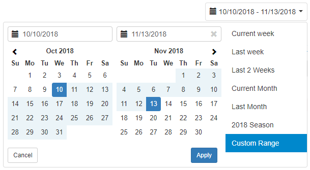

# taDateRangePicker

### Fork Notes:
In looking for a datepicker for an older AngularJS, I came across this library of a jQuery-less translation of the bootstrap date-range picker I had my eye on.

Unfortunately, it was outdated, so I forked to upgrade to a more modern workflow and process, and put my own API preferences & interactions on the tool.

Goals:

- Configurable date display formatting
- ~~Configurable selection styles~~
  - Select predefined range = applies selection
  - Select predefined range = updates calendars selection, and always requires Apply button
- ~~Remove dependencies~~
  - ~~bindonce~~ _- done_
  - ~~moment-range~~ _- done_
    - Didn't actually use any moment-range-specific things, just start and end, replaced with objects.
- configurable text-icon package
- toggle icon display
- Proper Build Steps
  - ~~NPM config~~
  - ~~Sass~~
  - JS Compiler w/ Webpack/Babel

### Pure AngularJS DateRangePicker (no jQuery required)

After searching all over for a simple AngularJS Date Range Picker that did not require jQuery, I ended writing this lite version. The CSS style is adapted from [dangrossman's bootstrap-daterangepicker](https://github.com/dangrossman/bootstrap-daterangepicker)

### Sample usage

    <ta-date-range-picker ng-model="dateRange" ranges="customRanges"
            callback="dateRangeChanged()"></ta-date-range-picker>

### Add required files

    <link rel="stylesheet" href="https://maxcdn.bootstrapcdn.com/bootstrap/3.3.6/css/bootstrap.min.css" />
    <link href="dist/ta-date-range-picker.css" rel="stylesheet" />

    
    
    

### Sample Code

    angular.module("app", ['tawani.utils'])
        .controller("MainCtrl", ['$scope', function ($scope) {

            // specify default date range in controller
            $scope.dateRange = { start: moment("2015-12-05"), end: moment("2016-01-25")};

            //Select range options
            $scope.customRanges = [
                {
                    label: "This week",
                    range: {
                        start: moment().startOf("week").startOf("day"),
                        end: moment().endOf("week").startOf("day")
                    }
                },
                {
                    label: "Last month",
                    range: {
                        start: moment().add(-1, "month").startOf("month").startOf("day"),
                        end: moment().add(-1, "month").endOf("month").startOf("day")
                    }
                },
                {
                    label: "This month",
                    range: {
                        start: moment().startOf("month").startOf("day"),
                        end: moment().endOf("month").startOf("day")
                    }
                }
            ];

            $scope.SelectedRangeText = "None";
            $scope.dateRangeChanged = function() {
                $scope.SelectedRangeText = `from  ${$scope.dateRange.start.format("LL")}
                                            to ${$scope.dateRange.end.format("LL")}`;
            }

        }]);

### Dependencies

- [Moment.js](https://github.com/moment/moment)

### Attributes

| Name                    | Type               | Default                              | Description                                                                                                                       |
| ----------------------- | ------------------ | ------------------------------------ | --------------------------------------------------------------------------------------------------------------------------------- |
| `ng-model`              | Object, required   | `{ start: moment(), end: moment() }` | An object with start and end keys pointing to moment.js objects.                                                                  |
| `ranges`                | Object, optional   |                                      | an array of objects, each with a label:"text" and range: {start, end} values. See above example.                                  |
| `callback`              | Function, optional |                                      | Callback function is called when the dates are changed / applied                                                                  |
| `always-show-calendars` | N/A                | `false`                              | Will always show the calendars. Default is to only show calendar if the custom range button is clicked.                           |
| `must-apply`            | N/A                | `false`                              | Requires the Apply button to be clicked regardless of selecting a custom range or a predefined range. Always shows the calendars. |
